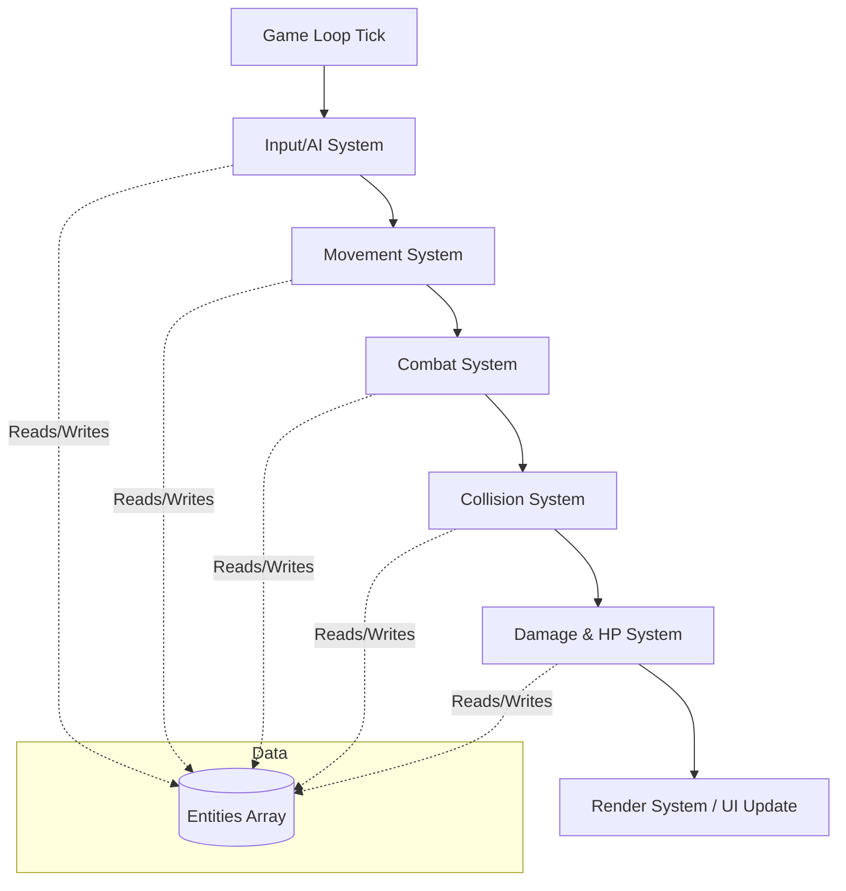

# Aether-Core GDD: Technical Architecture

**Architecture:** ECS (Entity-Component-System) to support 1,000+ entities with zero framerate drops.
**Frontend/UI Stack:** React with TypeScript (or React Native for mobile wrapping), utilizing framer-motion for UI animations.
**Game Logic Loop:** Custom high-performance TypeScript logic loop (or WebAssembly/WebGL binding for rendering if using browser tech).
**State Management:** Zustand or Redux for handling non-combat state (Pre-Run Config, Unlocks).

## 4.1 Core Components
*   `TransformComponent`: `Vector2 Position`, `Vector2 Rotation`
*   `StatsComponent`: `HP`, `MaxHP`, `ATK`, `MoveSpeed`, `AttackSpeed`
*   `AIComponent`: `TargetID`, `CurrentState`
*   `WeaponComponent`: `ProjectilePrefab`, `FireRateTimer`
*   `ColliderComponent`: `Radius`, `LayerMask`

## 4.2 Core Systems
*   **MovementSystem:** Updates Position based on Velocity and AIComponent.
*   **CombatSystem:** Checks weapon cooldown and spawns Projectile Entities.
*   **CollisionSystem:** Calculates Circle-Circle Intersection using Spatial Partitioning.
*   **DamageSystem:** Listens for collision events. Formula: `FinalDamage = (BaseATK * Multipliers) - EnemyDEF`

## 4.3 ECS Architecture Flow



## 4.4 Save Data Structure (Zero-Meta)
Even with zero-meta progression, we must persist certain data locally:
```json
{
  "Settings": { "BGMVolume": 0.8, "SFXVolume": 1.0 },
  "Statistics": { "HighestStage": 42, "TotalRuns": 15, "EnemiesKilled": 15420 },
  "Unlocks": { "Characters": ["CHR_01", "CHR_02"], "Weapons": ["WEP_01"] }
}
```
